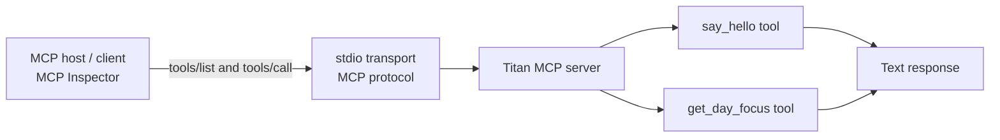
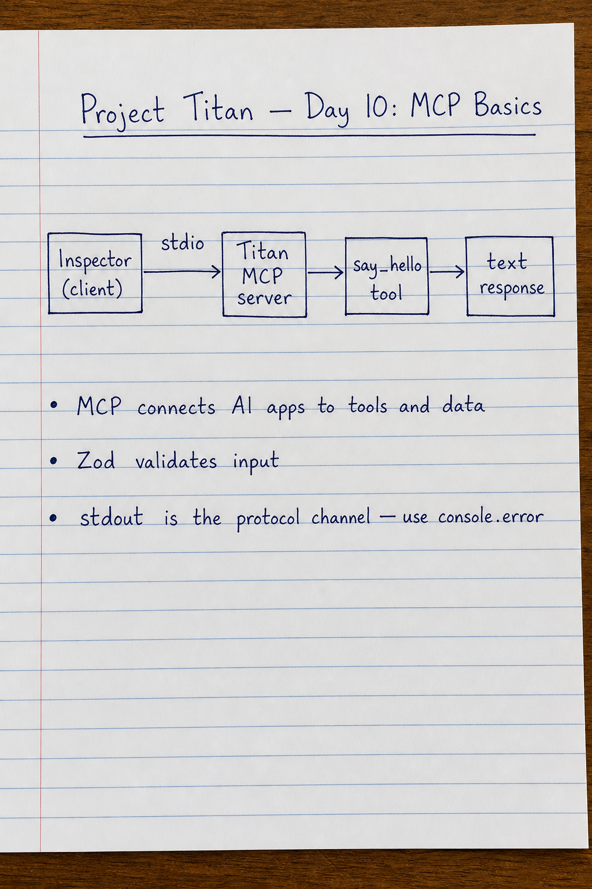

# Project Titan — Day 10: MCP Basics

My first **Model Context Protocol (MCP)** server, built with TypeScript.

## What I built

This project exposes two tools that an MCP-compatible client can discover and call:

- `say_hello` — returns a greeting for a supplied name.
- `get_day_focus` — returns the topic for a Project Titan study day (1–10).

## MCP architecture



In plain English:

```text
Inspector (client) → stdio → Titan MCP server → tool → text response
```

The **host/client** decides which tool to use. The **MCP server** exposes those tools and executes the requested one. MCP itself is the standard way they communicate; it is not an agent and it is not RAG.

## Key ideas

| Concept | What it means here |
| --- | --- |
| MCP server | The TypeScript program in `src/index.ts`. |
| MCP client/host | MCP Inspector, which starts the server and calls its tools. |
| Tool | A named function the client can discover and call, such as `say_hello`. |
| Zod schema | Defines and validates the tool input before the handler runs. |
| stdio | The local transport: client and server communicate through standard input/output. |

## Input validation example

`get_day_focus` uses this type of input rule:

```ts
day: z.number().int().min(1).max(10)
```

That means the value must be a whole number from 1 to 10. Invalid input, such as `11` or `2.5`, is rejected before the tool handler runs.

`describe()` is different: it documents the expected input for the client/model but does not perform validation.

## Run the server

```powershell
npx tsx src/index.ts
```

The server waits for an MCP client. Seeing only the startup message is expected.

> Important: stdout carries MCP protocol messages. Use `console.error(...)` for human-readable logs, not `console.log(...)`.

## Test with MCP Inspector

```powershell
npx @modelcontextprotocol/inspector npx tsx src/index.ts
```

Then connect, open **Tools**, and call either tool. Example:

```json
{ "name": "Rudra" }
```

```json
{ "day": 10 }
```

## Handwritten revision note



## Packages

- `@modelcontextprotocol/server` — official MCP TypeScript server SDK.
- `zod` — input schemas and validation.
- `tsx` — runs TypeScript directly during development.

## Exam-ready summary

**MCP (Model Context Protocol)** is an open standard that lets AI applications communicate with tools and data sources. An agent or host can decide that it needs a capability; an MCP server provides that capability through tools, resources, or prompts. MCP standardizes the communication—it does not make decisions by itself.
