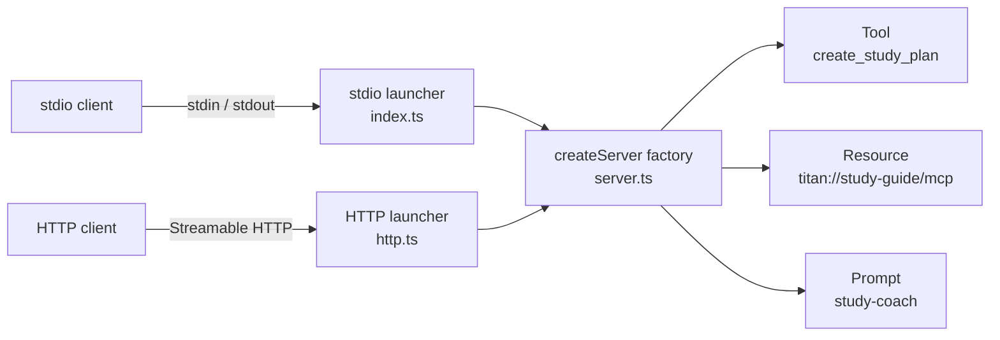
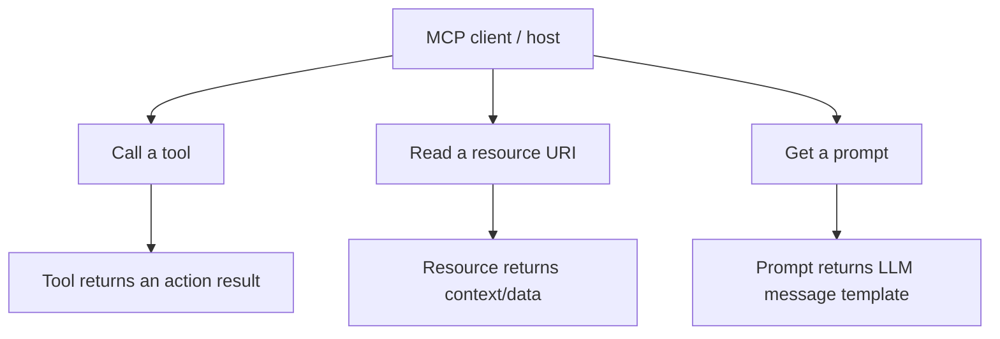
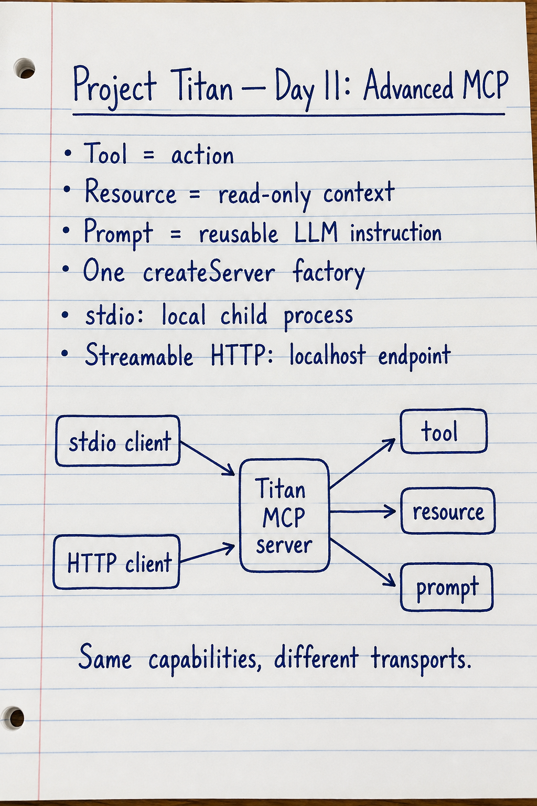

# Project Titan — Day 11: Advanced MCP

An advanced **Model Context Protocol (MCP)** project written in TypeScript. This project exposes a study-assistant server through both local `stdio` and Streamable HTTP, then connects to it with custom clients.

## What I built

The Titan MCP server provides all three core MCP capability types:

| Capability | Name | What it does |
| --- | --- | --- |
| Tool | `create_study_plan` | Generates a focused plan for MCP, RAG, or agents. |
| Resource | `titan://study-guide/mcp` | Provides read-only MCP study notes. |
| Prompt | `study-coach` | Supplies a reusable instruction for an LLM study coach. |

## Architecture



The important design decision is that `server.ts` defines the capabilities **once**. The transport files only decide how clients reach them.

```text
Same server capabilities
├── stdio: a local client starts the server as a child process
└── HTTP: a client connects to http://127.0.0.1:3000/mcp
```

## Tool, resource, and prompt



| Type | Client action | Example |
| --- | --- | --- |
| Tool | `tools/call` | Create a 60-minute MCP study plan. |
| Resource | `resources/read` | Read the MCP study guide. |
| Prompt | `prompts/get` | Get a beginner-friendly study-coach instruction. |

MCP does not decide which capability to use. A host or agent makes that decision; the server exposes the capabilities through a standard protocol.

## Project structure

```text
day-11-mcp-advanced/
├── src/
│   ├── server.ts       # Capability definitions and createServer factory
│   ├── index.ts        # Local stdio server launcher
│   ├── client.ts       # Local stdio client
│   ├── http.ts         # Local Streamable HTTP server launcher
│   └── http-client.ts  # Streamable HTTP client
├── assets/
│   └── day-11-advanced-mcp-handwritten-note.png
├── package.json
└── README.md
```

## Core code examples

### 1. One reusable server factory

```ts
export function createServer(): McpServer {
  const server = new McpServer({
    name: "titan-study-assistant",
    version: "1.0.0",
  });

  // Register tools, resources, and prompts here.
  return server;
}
```

This prevents drift: stdio and HTTP always expose the same MCP features.

### 2. Tool with validation

```ts
server.registerTool(
  "create_study_plan",
  {
    description: "Create a focused study plan for an AI topic.",
    inputSchema: z.object({
      topic: z.enum(["mcp", "rag", "agents"]),
      minutes: z.number().int().min(15).max(180),
      level: z.enum(["beginner", "intermediate"]),
    }),
  },
  async ({ topic, minutes, level }) => ({
    content: [{ type: "text", text: `Study ${topic} for ${minutes} minutes.` }],
  }),
);
```

Zod validates the request before the tool handler runs. For example, `minutes: 5` or `topic: "MCP"` is rejected because it does not match the schema.

### 3. Resource: read-only context

```ts
server.registerResource(
  "mcp-study-guide",
  "titan://study-guide/mcp",
  { title: "MCP Study Guide", mimeType: "text/plain" },
  async (uri) => ({
    contents: [{ uri: uri.href, text: "MCP connects AI applications to tools and data." }],
  }),
);
```

The URI is a stable identifier inside MCP. It is not a website URL.

### 4. Prompt: reusable LLM instruction

```ts
server.registerPrompt(
  "study-coach",
  {
    description: "Create a focused learning conversation for an AI topic.",
    argsSchema: z.object({
      topic: z.enum(["mcp", "rag", "agents"]),
      level: z.enum(["beginner", "intermediate"]),
    }),
  },
  ({ topic, level }) => ({
    messages: [{
      role: "user",
      content: { type: "text", text: `Teach ${topic} to a ${level} learner.` },
    }],
  }),
);
```

The prompt returns a message template. It does not call an LLM or generate an answer by itself.

### 5. Two transports, one factory

Local stdio launcher (`src/index.ts`):

```ts
import { serveStdio } from "@modelcontextprotocol/server/stdio";
import { createServer } from "./server.ts";

void serveStdio(createServer);
```

Streamable HTTP launcher (`src/http.ts`):

```ts
const app = createMcpFastifyApp();
const mcpHandler = createMcpHandler(createServer);
const nodeHandler = toNodeHandler(mcpHandler);

app.all("/mcp", async (request, reply) => {
  await nodeHandler(request.raw, reply.raw, request.body);
});

await app.listen({ host: "127.0.0.1", port: 3000 });
```

`127.0.0.1` keeps the tutorial HTTP server reachable only from this computer.

### 6. HTTP client connection

```ts
const client = new Client({ name: "titan-http-client", version: "1.0.0" });

const transport = new StreamableHTTPClientTransport(
  new URL("http://127.0.0.1:3000/mcp"),
);

await client.connect(transport);
const { tools } = await client.listTools();
```

## Run and test

### Local stdio version

```powershell
npx tsx src/client.ts
```

The client starts `src/index.ts`, discovers capabilities, reads the resource, gets the prompt, calls the tool, then closes the connection.

### Streamable HTTP version

In terminal 1:

```powershell
npx tsx src/http.ts
```

In terminal 2:

```powershell
npx tsx src/http-client.ts
```

Opening `/mcp` in a normal browser can return **Method not allowed**. That is expected: a browser sends a normal `GET`, while the endpoint expects MCP protocol requests from an MCP client.

## What the completed test proves

```text
HTTP client
  → connects to the local MCP endpoint
  → lists tools, resources, and prompts
  → reads titan://study-guide/mcp
  → retrieves study-coach
  → calls create_study_plan
  → receives a typed text response
```

## Handwritten revision note



## Exam-ready summary

**Model Context Protocol (MCP)** is an open standard for connecting AI applications to tools and data. A server can expose **tools** (actions), **resources** (read-only context), and **prompts** (reusable LLM message templates). A client or host discovers and uses those capabilities through an MCP transport, such as local `stdio` or Streamable HTTP. MCP standardizes communication; it is not itself an agent, an LLM, or RAG.
